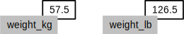

In this lesson we will learn how to manipulate the inflammation dataset with Python. But before we discuss how to deal with many data points, we will show how to store a single value on the computer.

The line below [assigns](reference.html#assignment) the value `55` to a [variable](reference.html#variable) `weight_kg`:

~~~
weight_kg = 55
~~~
{: .python}

A variable is just a name for a value,
such as `x`, `current_temperature`, or `subject_id`.
Python's variables must begin with a letter and are [case sensitive](reference.html#case-sensitive).
We can create a new variable by assigning a value to it using `=`.
When we are finished typing and press Shift+Enter,
the notebook runs our command.

Once a variable has a value, we can print it to the screen:

~~~
print(weight_kg)
~~~
{: .python}

~~~
55
~~~
{: .output}

and do arithmetic with it:

~~~
print('weight in pounds:', 2.2 * weight_kg)
~~~
{: .python}

~~~
weight in pounds: 121.0
~~~
{: .output}

As the example above shows,
we can print several things at once by separating them with commas.

We can also change a variable's value by assigning it a new one:

~~~
weight_kg = 57.5
print('weight in kilograms is now:', weight_kg)
~~~
{: .python}

~~~
weight in kilograms is now: 57.5
~~~
{: .output}

If we imagine the variable as a sticky note with a name written on it,
assignment is like putting the sticky note on a particular value:

This means that assigning a value to one variable does *not* change the values of other variables.
For example,
let's store the subject's weight in pounds in a variable:

~~~
weight_lb = 2.2 * weight_kg
print('weight in kilograms:', weight_kg, 'and in pounds:', weight_lb)
~~~
{: .python}

~~~
weight in kilograms: 57.5 and in pounds: 126.5
~~~
{: .output}

and then change `weight_kg`:

~~~
weight_kg = 100.0
print('weight in kilograms is now:', weight_kg, 'and weight in pounds is still:', weight_lb)
~~~
{: .python}

~~~
weight in kilograms is now: 100.0 and weight in pounds is still: 126.5
~~~
{: .output}

Since `weight_lb` doesn't "remember" where its value came from,
it isn't automatically updated when `weight_kg` changes.
This is different from the way spreadsheets work.

> ## Who's Who in Memory
>
> You can use the `%whos` command at any time to see what
> variables you have created and what modules you have loaded into the computer's memory.
> As this is an IPython command, it will only work if you are in an IPython terminal or the Jupyter Notebook.
>
> ~~~
> %whos
> ~~~
> {: .python}
>
> ~~~
> Variable    Type       Data/Info
> --------------------------------
> numpy       module     <module 'numpy' from '/Us<...>kages/numpy/__init__.py'>
> weight_kg   float      100.0
> weight_lb   float      126.5
> ~~~
> {: .output}
{: .callout}

Words are useful,
but what's more useful are the sentences and stories we build with them.
Similarly,
while a lot of powerful, general tools are built into languages like Python,
specialized tools built up from these basic units live in [libraries](reference.html#library)
that can be called upon when needed.

In order to load our inflammation data,
we need to access ([import](reference.html#import) in Python terminology)
a library called [NumPy](http://docs.scipy.org/doc/numpy/ "NumPy Documentation").
In general you should use this library if you want to do fancy things with numbers,
especially if you have matrices or arrays.
We can import NumPy using:

~~~
import numpy
~~~
{: .python}

Importing a library is like getting a piece of lab equipment out of a storage locker and setting it up on the bench.
Libraries provide additional functionality to the basic Python package,
much like a new piece of equipment adds functionality to a lab space. Just like in the lab, importing too many libraries
can sometimes complicate and slow down your programs - so we only import what we need for each program.
Once you've imported the library,
we can ask the library to read our data file for us:

~~~
numpy.loadtxt(fname='inflammation-01.csv', delimiter=',')
~~~
{: .python}

~~~
array([[ 0.,  0.,  1., ...,  3.,  0.,  0.],
       [ 0.,  1.,  2., ...,  1.,  0.,  1.],
       [ 0.,  1.,  1., ...,  2.,  1.,  1.],
       ...,
       [ 0.,  1.,  1., ...,  1.,  1.,  1.],
       [ 0.,  0.,  0., ...,  0.,  2.,  0.],
       [ 0.,  0.,  1., ...,  1.,  1.,  0.]])
~~~
{: .output}

The expression `numpy.loadtxt(...)` is a [function call](reference.html#function-call)
that asks Python to run the [function](reference.html#function) `loadtxt` which belongs to the `numpy` library.
This [dotted notation](reference.html#dotted-notation) is used everywhere in Python
to refer to the parts of things as `thing.component`.

`numpy.loadtxt` has two [parameters](reference.html#parameter):
the name of the file we want to read,
and the [delimiter](reference.html#delimiter) that separates values on a line.
These both need to be character strings (or [strings](reference.html#string) for short),
so we put them in quotes.

Since we haven't told it to do anything else with the function's output,
the notebook displays it.
In this case,
that output is the data we just loaded.
By default,
only a few rows and columns are shown
(with `...` to omit elements when displaying big arrays).
To save space,
Python displays numbers as `1.` instead of `1.0`
when there's nothing interesting after the decimal point.

Our call to `numpy.loadtxt` read our file,
but didn't save the data in memory.
To do that,
we need to assign the array to a variable. Just as we can assign a single value to a variable, we can also assign an array of values
to a variable using the same syntax.  Let's re-run `numpy.loadtxt` and save its result:

~~~
data = numpy.loadtxt(fname='inflammation-01.csv', delimiter=',')
~~~
{: .python}

This statement doesn't produce any output because assignment doesn't display anything.
If we want to check that our data has been loaded,
we can print the variable's value:

~~~
print(data)
~~~
{: .python}

~~~
[[ 0.  0.  1. ...,  3.  0.  0.]
 [ 0.  1.  2. ...,  1.  0.  1.]
 [ 0.  1.  1. ...,  2.  1.  1.]
 ...,
 [ 0.  1.  1. ...,  1.  1.  1.]
 [ 0.  0.  0. ...,  0.  2.  0.]
 [ 0.  0.  1. ...,  1.  1.  0.]]
~~~
{: .output}

Now that our data is in memory,
we can start doing things with it.
First,
let's ask what [type]({{ page.root }}/reference/#type) of thing `data` refers to:

~~~
print(type(data))
~~~
{: .python}

~~~
<class 'numpy.ndarray'>
~~~
{: .output}

The output tells us that `data` currently refers to
an N-dimensional array created by the NumPy library.
These data correspond to arthritis patients' inflammation.
The rows are the individual patients and the columns
are their daily inflammation measurements.
